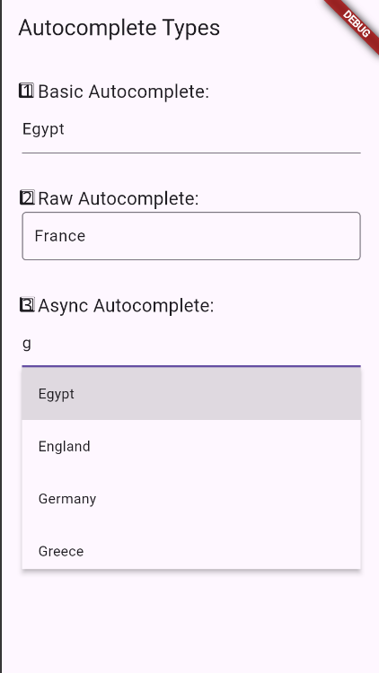

# 🧪 Inputs Playground

A Flutter project for experimenting with different **input-related widgets**, demonstrating how to capture, process, and respond to user interactions.

This project includes hands-on examples of:

### 🔍 Widget Overview

- **`Autocomplete`**  
  Offers real-time suggestions to users as they type. Flutter supports:
  - **Basic Autocomplete**: Simple dropdown of suggestions based on user input.
  - **Raw Autocomplete**: Gives more control over how suggestions and fields are built.
  - **Async Autocomplete**: Loads suggestions from an asynchronous data source (e.g. network or database).

- **`Form`**  
  A container for grouping and validating multiple input fields. It manages the state and validation of its child form fields.

- **`FormField`**  
  The building block for form inputs (like `TextFormField`). It provides validation, saving, and state handling for individual fields.

- **`KeyboardListener`**  
  Detects and responds to raw keyboard events (e.g. arrow keys, shortcuts), especially useful for desktop/web apps.

---

## 📸 Screenshots

### 🔤 Autocomplete

#### ✅ Basic Autocomplete


#### ⚙️ Raw Autocomplete


#### 🌐 Async Autocomplete


---

### 📝 Form Examples

#### 🧾 Simple Form


#### 🧪 Form Validation


---

### 🧩 FormField Example


---

### ⌨️ Keyboard Listener Example


---

## 🚀 Getting Started

1. **Clone the repo**
   ```bash
   git clone https://github.com/Hebabo/Inputs.git
   cd Inputs
   ```

2. **Get packages**

   ```bash
   flutter pub get
   ```

3. **Run the app**

   ```bash
   flutter run
   ```

---

## 📂 Structure

Each input example is structured in a separate widget or screen to keep things modular and easy to follow.

---

## 🛠️ Purpose

This project was created as a sandbox to try out and understand how Flutter handles various types of user inputs, including form handling, real-time suggestions, validation, and keyboard input.

---

## 🙌 Contributions

This project is mainly for learning, but feel free to fork or explore as needed!

---

## 📄 License

MIT – free to use, learn, and build upon.
---
